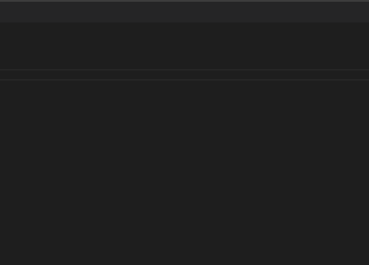

# Python Resource Monitor

Until now, resource and performance monitor extensions in VS Code only displayed current global resource consumption data via lists and text. Likewise, it is very awkward to use third-party tools to find the process you want to monitor.

However, this extension provides an easier, graphical solution that can show data specific to the process being used by the Python debugger! _Yeah, so I made this because searching for the right python process in task manager was annoying_

## Features

Provides a resource monitor that is opened when debugging Python, including process memory and cpu usage. Automatically launches (or reuses existing tab) upon debugging with Python.

_Test program storing strings of random sizes in memory_

### Uses theme colors

| Command                   | Usage                                                                                                                               |
| ------------------------- | ----------------------------------------------------------------------------------------------------------------------------------- |
| `PyRSM: Length`           | Set the maximum log length in milliseconds of the resource monitor. Set to `0` to allow unlimited length (time display will scale). |
| `PyRSM: Polling Interval` | Set the time between datapoints in milliseconds.                                                                                    |

## Known Issues and Future Updates

- Hopefully, this will one day work for many languages and debuggers!
- Not tested on MacOS.
- I don't think it will work with the Python multiprocessing module quite yet.

## Recent Major Updates

### 0.1.0

Millisecond-accuracy for CPU usage. When writing the module, tested with Linux.

### 0.1.3

Native addon build now includes binaries.
